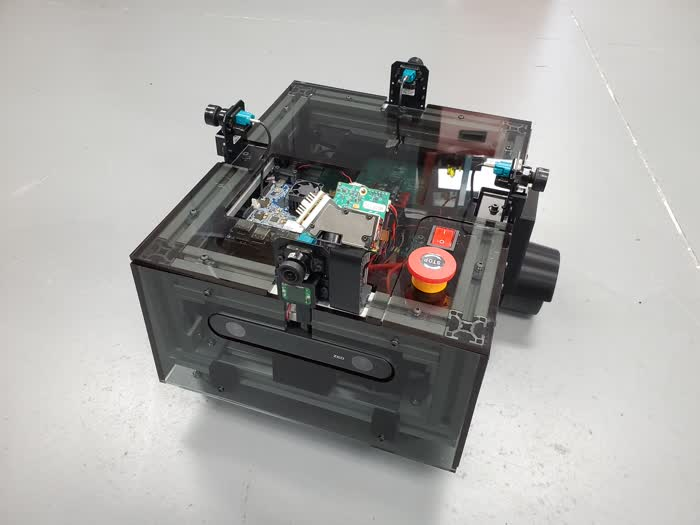

TI-D3 Mobile Robot Demos
========================

<p align="left">
  
</p>

<!-- ======================================================================= -->
## TI-D3 Mobile Robot

[](https://www.youtube.com/watch?v=rrhvhDdtyF8)

<p align="left">
  
</p>

The TI-D3 mobile robot has following hardware components:

| HW Component                       | Part                                                                                                                        |
| ---------------------------------- | --------------------------------------------------------------------------------------------------------------------------- |
| Main Processor                     | [TDA4VM](https://www.ti.com/product/TDA4VM)                                                                                 |
| Main Processor Board               | [SK-TDA4VM](https://www.ti.com/tool/SK-TDA4VM)                                                                              |
| FPD-Link Interface Board           | [TDA4 Fusion1 Rev C board](https://svtronics.com/portfolio/evm577pfusion-v1-0-fusion/)                                      |
| Camera and Radar Fusion Sensor Kit | [FS-6843AOP-IMX390](https://www.d3engineering.com/product/designcore-fs-6843aop-imx390-fusion-sensor/)                      |
| Motor Controller                   | [TMS320F280039C](https://www.ti.com/product/TMS320F280039C), [BOOSTXL-DRV8323RS](https://www.ti.com/tool/BOOSTXL-DRV8323RS) |
| DLP Projector                      | [DLP3021LEQ1EVM](https://www.ti.com/tool/DLP3021LEQ1EVM)                                                                    |


<!-- ======================================================================= -->
## Getting Started: Software Setup

### Preparing SD Card Image
Download the prebuilt SD card image from [this link](https://software-dl.ti.com/jacinto7/esd/robotics-sdk/data/ti-processor-sdk-linux-sk-tda4vm-etcher-image-8.4-tid3.zip). This pre-built SD card has a couple of post-release patches (listed below) applied on top of [Processor SDK Linux for Edge AI 8.4](https://software-dl.ti.com/jacinto7/esd/processor-sdk-linux-sk-tda4vm/08_04_00/exports/docs/index.html):
- V4L2 fix for IMX390 camera
- XR USB serial driver for D3's IWR6843AOP radar sensor

Flash the downloaded image to a SD card using the balenaEtcher tool, referring to the following section of Edge AI documentation: ["Preparing SD card image"](https://software-dl.ti.com/jacinto7/esd/processor-sdk-linux-sk-tda4vm/latest/exports/docs/getting_started.html#preparing-sd-card-image).

### Robotics SDK
The TI-D3 mobile robot demos require [Robotics SDK 8.4](https://software-dl.ti.com/jacinto7/esd/robotics-sdk/08_04_00/docs/index.html). Referring to the following sections of the SDK documentation, please build the Robotics SDK Docker image, and build the ROS packages provided in the SDK on the TDA4 and also on the Ubuntu PC.
- [Setting Up Robotics SDK](https://software-dl.ti.com/jacinto7/esd/robotics-sdk/08_04_00/docs/source/docker/README.html#setting-up-robotics-sdk)
- [Docker Setup for ROS 1](https://software-dl.ti.com/jacinto7/esd/robotics-sdk/08_04_00/docs/source/docker/setting_docker_ros1.html#docker-setup-for-ros-1)

### Build the ROS Packages

On a SSH terminal for the TDA4, download and run [`init_setup.sh`](https://raw.githubusercontent.com/TexasInstruments/ti-d3-mobile-robot-demos/master/init_setup.sh):

```
wget -O init_setup.sh https://raw.githubusercontent.com/TexasInstruments/ti-d3-mobile-robot-demos/master/init_setup.sh
bash ./init_setup.sh
```
The setup script performs:
- Git-clone the project git repository
- Install the mmWave radar driver ROS node
- Install ROS nodes from D3 Engineering's  git repositories
- Update DTBO overlay to use IMX390 cameras
- Install LDC binary files for IMX390 cameras

The folder structure for the TI-D3 mobile robot project is as follows:
```txt
/opt/ti-d3-mobile-robot-demos/ # Project folder
+ README.md
+ docs/
+ docker/
+ scripts/
+ nodes/                       # Pass to 'catkin_make --source ...'
  + ti_detect_go/
  + ti_dlp_command/
  + tid3_robot_demos/
  + radar_driver
    + ti_mmwave_tracker_rospkg/
    + serial/
  + d3_nodes
    + d3_fusion/
    + d3_gamepad/
    + d3_motorctl/
```

### Set Up Docker Environment for the Project
Build the Docker container for the project:
```
/opt/ti-d3-mobile-robot-demos/docker/docker_build.sh
```

You can check if the Docker image is successfully built:
```
root@tda4vm-sk:/opt# docker images
REPOSITORY         TAG           IMAGE ID            CREATED            SIZE
j7-ros-noetic      8.4_tid3      249c4a3befa9        1 days ago         3.4GB
j7-ros-noetic      8.4           43dcdd403859        1 days ago         3.39GB
ubuntu             20.04         08f5c0d9d654        2 months ago       65.5MB
```

Run the Docker container for the project:
```
/opt/ti-d3-mobile-robot-demos/docker/docker_run.sh
```

Please note that we will use a separate ROS workspace, `$HOME/j7ros_home/tid3_ws`, for the project. We assume that Robotics SDK has been already built under `$HOME/j7ros_home/ros_ws`.
```
$HOME/j7ros_home/
+ ros_ws  # Exiting Robotic SDK workspace. Assume already ROS apps built following the SDK doc
+ tid3_ws # TI-D3 Mobile Robot project workspace
```

Build the ROS packages inside the project Docker container:
```
cd ~/j7ros_home/tid3_ws
# this is important to use the packages from Robotics SDK
source ~/j7ros_home/ros_ws/devel/setup.bash
catkin_make --source /opt/ti-d3-mobile-robot-demos/nodes
source devel/setup.bash
```

<!-- ====================================================================== -->
### Preparing Software on Ubuntu PC

A Ubuntu PC is required for visualization of ROS topics published from the TDA4 target. We have tested only with native x86_64 Ubuntu PCs, and have not tested with any other Ubuntu systems: including Ubuntu virtual machines and Docker Desktop on Mac or Windows.

Download and run [`init_setup.sh`](https://raw.githubusercontent.com/TexasInstruments/ti-d3-mobile-robot-demos/master/init_setup.sh)
```
cd ~/j7ros_home
wget -O init_set.sh https://raw.githubusercontent.com/TexasInstruments/ti-d3-mobile-robot-demos/master/init_setup.sh
bash ./init_setup.sh
```

The project is installed under `$HOME/j7ros_home/tid3_ws/src` folder.

In a similar way as in TDA4, we have two ROS workspaces:
```
$HOME/j7ros_home/
+ ros_ws  # Robotic SDK workspace. Assume ROS apps have been already built following the SDK doc
+ tid3_ws # TI-D3 Mobile Robot workspace
```

Build the Docker container for the project:
```
$HOME/j7ros_home/tid3_ws/src/ti-d3-mobile-robot-demos/docker/docker_build_pc.sh
```

For ROS network settings, update `J7_IP_ADDR` and `PC_IP_ADDR` in `$HOME/j7ros_home/setup_env_pc.sh`.
```
source $HOME/j7ros_home/setup_env_pc.sh
```

Run the project Docker image:
```
$HOME/j7ros_home/tid3_ws/src/ti-d3-mobile-robot-demos/docker/docker_run_pc.sh
```

Build the ROS packages inside the project Docker container:
```
cd ~/j7ros_home/tid3_ws
# this is important to use the packages from Robotics SDK
source ~/j7ros_home/ros_ws/devel/setup.bash
catkin_make
source devel/setup.bash
```

<!-- ====================================================================== -->
### Run the Demo: Camera + Radar Sensor Fusion, Motor Control and DLP Projection

**TDA4**:
Run the Docker container for the project:
```
/opt/ti-d3-mobile-robot-demos/docker/docker_run.sh
```

In the project Docker container:
```
source devel/setup.bash
roslaunch tid3_robot_demos fusion_detect_go.launch
```

**PC**:
Make sure `J7_IP_ADDR` and `PC_IP_ADDR` are set correctly in `$HOME/j7ros_home/setup_env_pc.sh`.
```
source $HOME/j7ros_home/setup_env_pc.sh
```

Run the project Docker image:
```
$HOME/j7ros_home/tid3_ws/src/ti-d3-mobile-robot-demos/docker/docker_run_pc.sh
```

In the project Docker container:
```
roslaunch d3_fusion fusion_viz.launch
```

### Teleop with a Gamepad
**TDA4**:
In the project Docker container:
```
source devel/setup.bash
roslaunch d3_fusion drive.launch
```
