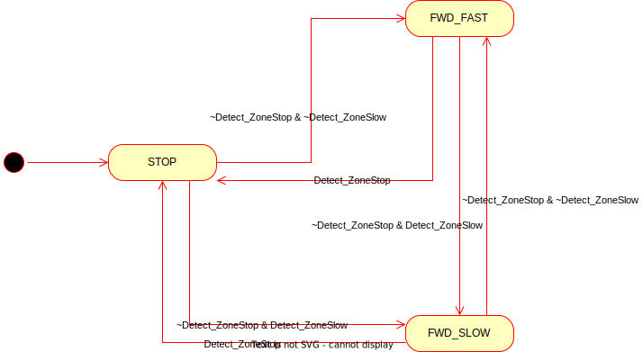

ti_detect_go: Simple Navigation Node
====================================

This ROS node subscribes the radar tracker output topic form `ti_mmwave_tracker_rospkg` ROS node, and
set `nav_vel` (`geometry_msgs/Twist`) based on whether object(s) are detected in predefined two zones. Currently following three basic move actions are defined: stop, move forward slowly, move forward fast.

**Dependency**: `ti_mmwave_tracker_rospkg` ROS node version that publishes the radar tracker output in array format using `RadarTrackArray.msg` and `RadarTrackContents.msg`.

`RadarTrackArray.msg`:
```
Header header
uint32 num_tracks
RadarTrackContents[] track
```

`RadarTrackContents.msg`:
```
Header header
uint32 tid
float32 posx
float32 posy
float32 posz
float32 velx
float32 vely
float32 velz
float32 accx
float32 accy
float32 accz
```

## Zone Definitions
The zones are defined with in `[x_min, x_max, y_min, y_max]` format using three launch parameters: `zone_stop_xlim`, `zone_slow_xlim` and `zone_yabs`

- `zone_stop = [0.0, zone_stop_xlim, -zone_yabs, zone_yabs]`: defined in close proximity of the robot. When any object is detected in this zone, the robot is supposed to stop.
- `zone_slow = [zone_stop_xlim, zone_slow_xlim, -zone_yabs, zone_yabs]`: When any object is detected in this zone, the robot is supposed to move slowly with a predefined speed.

Note: radar measurements (point cloud and tracker output) in the frame definition: x (forward), y (left), z (upward).

## Finite State Machine
This node implements the following simple finite state machine.



### Events
- `Detect_ZoneStop`: Event where any object is detected in the `zone_stop`
- `Detect_ZoneSlow`: Event where any object is detected in the `zone_slow`

### States
- `STOP`: The robot is to stop.
- `FWD_SLOW`: The robot is to move forward in a slow speed (defined with a launch parameter, `speed_linear_slow`).
- `FWD_FAST`: The robot is to move forward in a fast speed (defined with a launch parameter, `speed_linear_fast`).

## Launch Examples

```
# with ROSBAG
roslaunch ti_detect_go bag_detect_go.launch

# with IWR6843ISK
roslaunch ti_detect_go iwr_detect_go.launch
```
